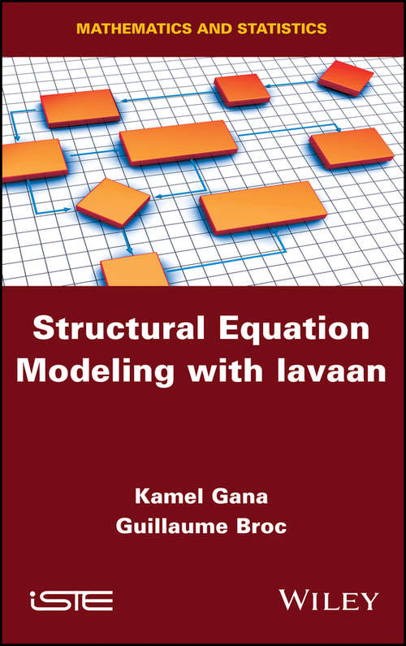
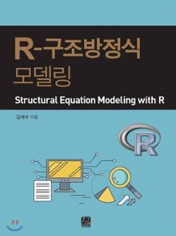
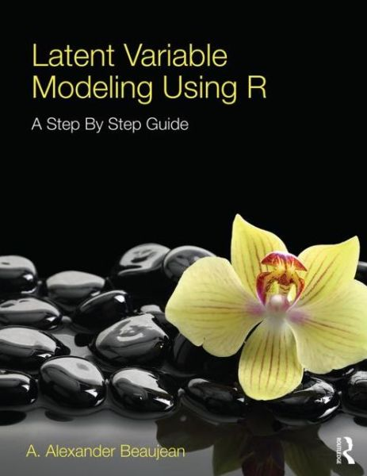
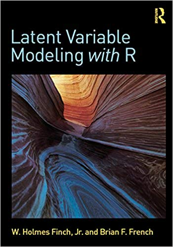

#### Books ####
On this page, we hope to provide lavaan syntax (or R syntax in general) to
replicate the examples given in several books on structural equation modeling,
factor analysis, latent variable analysis, and related methods.

If you have worked out the syntax for (many, perhaps not all) examples from a
particular book that is not yet listed below, please contact me if you are
willing to share your code on this page.

#### Structural Equation Modeling with lavaan ####

  

    
  

  

  <ul>
    <li>book title: Structural Equation Modeling with lavaan</li>
    <li>book author: Guillaume Broc and Kamel Gana</li>
    <li>book publisher: <a href="http://www.iste.co.uk/book.php?id=1437">ISTE/Wiley</a></li>
  </ul>
  

&nbsp;

#### Structural Equation Modeling with R (Korean) ####

  

    
  

  

  <ul>
    <li>book title: Structural Equation Modeling with R</li>
    <li>book author: <a href="https://sites.google.com/view/kimgyesoo">Kim Gye-Soo</a></li>
    <li>book publisher: <a href="http://www.hannarae.net/">Hannarae Publishing Co.</a></li>
  </ul>
  

&nbsp;

#### Lineare Strukturgleichungsmodelle: Eine Einführung mit R ####

  

    
  

  

  <ul>
    <li>book title: Lineare Strukturgleichungsmodelle: Eine Einführung mit R</li>
    <li>book author: Holger Steinmetz</li>
    <li>book publisher: <a href="http://hermes.hsu-hh.de/sowifome/2014/12/09/band-9-lineare-strukturgleichungsmodelle-eine-einfuehrung-mit-r/">Rainer Hampp Verlag</a></li>
  </ul>
  

&nbsp;

#### Strukturgleichungsmodelle in den Sozialwissenschaften ####

  

    
  

  

  <ul>
    <li>book title: Strukturgleichungsmodelle in den Sozialwissenschaften</li>
    <li>book author: Jost Reinecke</li>
    <li>book publisher: <a href="http://www.degruyter.com/view/product/214112">De Gruyter Oldenbourg</a></li>
  </ul>
  

&nbsp;

#### Latent Variable Modeling using R: A Step-By-Step Guide ####

  

    
  

  

  <ul>
    <li>book title: Latent Variable Modeling using R: A Step-By-Step Guide</li>
    <li>book author: A. Alexander Beaujean</li>
    <li>book publisher: <a href="http://www.routledge.com/books/details/9781848726994/">Routledge</a></li>
    <li>R syntax from the author is available on
    <a href="http://blogs.baylor.edu/rlatentvariable/sample-page/r-syntax/">this page</a></li>
  </ul>
  

&nbsp;

#### Latent Variable Modeling with R ####

  

    
  

  

  <ul>
    <li>book title: Latent Variable Modeling with R</li>
    <li>book authors: W. Holmes Finch and Brian F. French</li>
    <li>book publisher: <a href="https://www.routledge.com/Latent-Variable-Modeling-with-R-1st-Edition/Finch-French/p/book/9780415832458">Routledge</a></li>
  </ul>
  

&nbsp;

#### Confirmatory Factor Analysis for Applied Research ####

  

    
  

  

  <ul>
    <li>book title: Confirmatory Factor Analysis for Applied Research</li>
    <li>book author: Timothy A. Brown</li>
    <li>book publisher: <a href="http://www.guilford.com/cgi-bin/cartscript.cgi?page=pr/brown3.htm">Guildford Press</a></li>
    <li>R syntax (prepared by Jan Lammertyn, UGent) is available on
    <a href="https://github.com/janlammertyn/lavaan-material/tree/master/brown-cfa">GitHub</a></li>
  </ul>
  

&nbsp;

#### Principles and Practice of Structural Equation Modeling (Third Edition) ####

  

    
  

  

  <ul>
    <li>book title: Principles and Practice of Structural Equation Modeling (Third Edition)</li>
    <li>book author: Rex B. Kline</li>
    <li>book publisher: <a href="http://www.guilford.com/cgi-bin/cartscript.cgi?page=pr/kline.htm">Guildford Press</a></li>
    <li>R syntax (prepared by Catherine Gunsalus, Kansas University) is available (as a zip file) on
    <a href="https://github.com/rgroup-crmda/rgroup-crmda/blob/master/documentation/lavaan.Kline.examples.zip?raw=true">GitHub</a></li>
  </ul>
  

&nbsp;

