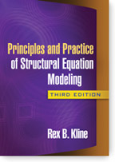

#### Books ####
On this page, we hope to provide lavaan syntax (or R syntax in general) to
replicate the examples given in several books on structural equation modeling,
factor analysis, latent variable analysis, and related methods.

If you have worked out the syntax for (many, perhaps not all) examples from a
particular book that is not yet listed below, please contact me if you are
willing to share your code on this page.

#### Confirmatory Factor Analysis for Applied Research ####

  

    
  

  

  <ul>
    <li>book title: Confirmatory Factor Analysis for Applied Research</li>
    <li>book author: Timothy A. Brown</li>
    <li>book publisher: <a href="http://www.guilford.com/cgi-bin/cartscript.cgi?page=pr/brown3.htm">Guildford Press</a></li>
    <li>R syntax (prepared by Jan Lammertyn, UGent) is available on
    <a href="https://github.com/janlammertyn/lavaan-material/tree/master/brown-cfa">GitHub</a></li>
  </ul>
  

&nbsp;

#### Principles and Practice of Structural Equation Modeling (Third Edition) ####

  

    
  

  

  <ul>
    <li>book title: Principles and Practice of Structural Equation Modeling (Third Edition)</li>
    <li>book author: Rex B. Kline</li>
    <li>book publisher: <a href="http://www.guilford.com/cgi-bin/cartscript.cgi?page=pr/kline.htm">Guildford Press</a></li>
    <li>R syntax (prepared by Catherine Gunsalus, Kansas University) is available (as a zip file) on
    <a href="https://github.com/rgroup-crmda/rgroup-crmda/blob/master/documentation/lavaan.Kline.examples.zip?raw=true">GitHub</a></li>
  </ul>
  

&nbsp;

#### Next book ####

