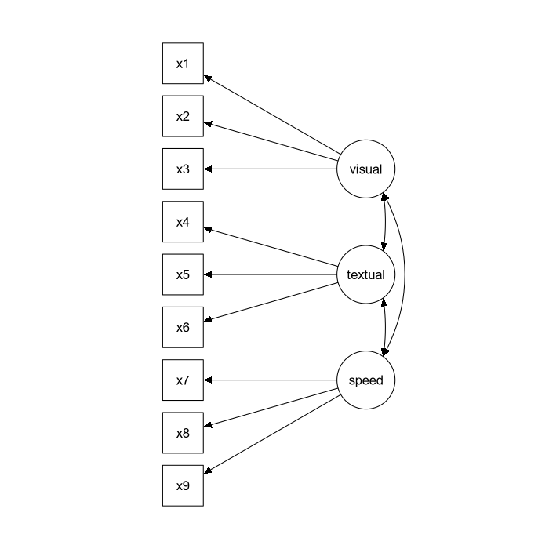

We start with a simple example of confirmatory factor analysis, using the
`cfa()` function, which is a user-friendly function for fitting CFA models.
The lavaan package contains a built-in dataset called `HolzingerSwineford1939`.
See the help page for this dataset by typing

    ?HolzingerSwineford1939

at the R prompt. This is a 'classic' dataset that is used in many papers and
books on Structural Equation Modeling (SEM). The data consists of mental
ability test scores of seventh- and eighth-grade children from two different
schools (Pasteur and Grant-White). In our version of the dataset, only 9 out of
the original 26 tests are included. A CFA model that is often proposed for
these 9 variables consists of three latent variables (or factors), each with
three indicators:

-   a *visual* factor measured by 3 variables: `x1`, `x2` and `x3`
-   a *textual* factor measured by 3 variables: `x4`, `x5` and `x6`
-   a *speed* factor measured by 3 variables: `x7`, `x8` and `x9`

The figure below contains a graphical representation of the
three-factor model.



The corresponding lavaan syntax for specifying this model
is as follows:

     visual =~ x1 + x2 + x3
    textual =~ x4 + x5 + x6
      speed =~ x7 + x8 + x9

In this example, the model syntax only contains three ‘latent variable
definitions’. Each formula has the following format:

    latent variable =~ indicator1 + indicator2 + indicator3

We call these expressions *latent variable definitions* because they define how
the latent variables are 'indicated by' a set of (typically observed)
variables, often called 'indicators'. Note that the special "`=~"` operator in
the middle consists of a sign ("`=`") character and a tilde (`"~"`) character
next to each other. The reason why this model syntax is so short, is that
behind the scenes, the `cfa()` function will take care of several things.
First, by default, the factor loading of the first indicator of a latent
variable is fixed to 1, thereby fixing the scale of the latent variable.
Second, residual variances are added automatically. And third, all exogenous
latent variables are correlated by default. This way, the model syntax can be
kept concise. On the other hand, the user remains in control, since all this
'default' behavior can be overriden and/or switched off.

We can enter the model syntax using the single quotes:


```r
HS.model <- ' visual  =~ x1 + x2 + x3 
              textual =~ x4 + x5 + x6
              speed   =~ x7 + x8 + x9 '
```

We can now fit the model as follows:


```r
fit <- cfa(HS.model, data = HolzingerSwineford1939)
```

The `cfa()` function is a dedicated function for fitting confirmatory factor
analysis models. The first argument is the user-specified model. The second
argument is the dataset that contains the observed variables. Once the model
has been fitted, the `summary()` function provides a nice summary of the fitted
model:


```r
summary(fit, fit.measures = TRUE)
```

The output should look familiar to users of other SEM software. If you find it
confusing or esthetically unpleasing, please let us know, and we will
try to improve it. 


```
lavaan 0.6-11 ended normally after 35 iterations

  Estimator                                         ML
  Optimization method                           NLMINB
  Number of model parameters                        21
                                                      
  Number of observations                           301
                                                      
Model Test User Model:
                                                      
  Test statistic                                85.306
  Degrees of freedom                                24
  P-value (Chi-square)                           0.000

Model Test Baseline Model:

  Test statistic                               918.852
  Degrees of freedom                                36
  P-value                                        0.000

User Model versus Baseline Model:

  Comparative Fit Index (CFI)                    0.931
  Tucker-Lewis Index (TLI)                       0.896

Loglikelihood and Information Criteria:

  Loglikelihood user model (H0)              -3737.745
  Loglikelihood unrestricted model (H1)      -3695.092
                                                      
  Akaike (AIC)                                7517.490
  Bayesian (BIC)                              7595.339
  Sample-size adjusted Bayesian (BIC)         7528.739

Root Mean Square Error of Approximation:

  RMSEA                                          0.092
  90 Percent confidence interval - lower         0.071
  90 Percent confidence interval - upper         0.114
  P-value RMSEA <= 0.05                          0.001

Standardized Root Mean Square Residual:

  SRMR                                           0.065

Parameter Estimates:

  Standard errors                             Standard
  Information                                 Expected
  Information saturated (h1) model          Structured

Latent Variables:
                   Estimate  Std.Err  z-value  P(>|z|)
  visual =~                                           
    x1                1.000                           
    x2                0.554    0.100    5.554    0.000
    x3                0.729    0.109    6.685    0.000
  textual =~                                          
    x4                1.000                           
    x5                1.113    0.065   17.014    0.000
    x6                0.926    0.055   16.703    0.000
  speed =~                                            
    x7                1.000                           
    x8                1.180    0.165    7.152    0.000
    x9                1.082    0.151    7.155    0.000

Covariances:
                   Estimate  Std.Err  z-value  P(>|z|)
  visual ~~                                           
    textual           0.408    0.074    5.552    0.000
    speed             0.262    0.056    4.660    0.000
  textual ~~                                          
    speed             0.173    0.049    3.518    0.000

Variances:
                   Estimate  Std.Err  z-value  P(>|z|)
   .x1                0.549    0.114    4.833    0.000
   .x2                1.134    0.102   11.146    0.000
   .x3                0.844    0.091    9.317    0.000
   .x4                0.371    0.048    7.779    0.000
   .x5                0.446    0.058    7.642    0.000
   .x6                0.356    0.043    8.277    0.000
   .x7                0.799    0.081    9.823    0.000
   .x8                0.488    0.074    6.573    0.000
   .x9                0.566    0.071    8.003    0.000
    visual            0.809    0.145    5.564    0.000
    textual           0.979    0.112    8.737    0.000
    speed             0.384    0.086    4.451    0.000
```

The output consists of three parts. The first nine lines are called *the
header*. The header contains the following information:

- the lavaan version number
- did optimization end normally or not, and how many iterations were needed
- the estimator that was used (here: `ML`, for maximum likelihood)
- the optimizer that was used to find the best fitting parameter values for this estimator (here: `NLMINB`)
- the number of model parameters (here: `21`)
- the number of observations that were effectively used in the analysis (here: `301`)
- a section called `Model Test User Model:` which provides a test statistic,
degrees of freedom, and a p-value for the model that was specified by the
user.

The next section contains additional fit measures, and is only shown because we
use the optional argument `fit.measures = TRUE`. It starts with the line `Model
Test Baseline Model:` and ends with the value for the `SRMR`.  The last section
contains the parameter estimates. It starts with (technical) information 
about the method that was used to compute the standard errors. (Most users
can safely ignore this information).
Then, it tabulates
all free (and fixed) parameters that were included in the model. Typically,
first the latent variables are shown, followed by covariances and (residual)
variances. The first column (`Estimate`) contains the (estimated or fixed)
parameter value for each model parameter; the second column (`Std.err`)
contains the standard error for each estimated parameter; the third column
(`Z-value`) contains the Wald statistic (which is simply obtained by dividing
the parameter value by its standard error), and the last column (`P(>|z|)`)
contains the p-value for testing the null hypothesis that the parameter value
equals zero in the population.


Note that in the `Variances:` section, there is a dot before the observed
variables names. This is because they are dependent (or endogenous) variables
(predicted by the latent variables), and therefore, the value for the variance
that is printed in the output is an estimate of the residual variance: the
left-over variance that is not explained by the predictor(s). By contrast,
there is no dot before the latent variable names, because they are exogenous
variables in this model (there are no single-headed arrows pointing to
them).
The values for the variances here are the estimated *total* variances of the
latent variables.


To wrap up this first example, we summarize the complete code that
was needed to fit this three-factor model:


```r
# load the lavaan package (only needed once per session)
library(lavaan)

# specify the model
HS.model <- ' visual  =~ x1 + x2 + x3      
              textual =~ x4 + x5 + x6
              speed   =~ x7 + x8 + x9 '

# fit the model
fit <- cfa(HS.model, data = HolzingerSwineford1939)

# display summary output
summary(fit, fit.measures = TRUE)
```
 
Simply copying this code and pasting it in R should work. The syntax
illustrates the typical workflow in the lavaan package:

1.  Specify your model using the lavaan model syntax. In this example, only
*latent variable definitions* have been used. In the following examples, other
formula types will be used.

2.  Fit the model. This requires a dataset containing the observed variables
(or alternatively the sample covariance matrix and the number of observations).
In this example, we have used the `cfa()` function. Other functions in the
lavaan package are `sem()` and `growth()` for fitting full structural equation
models and growth curve models respectively. All three functions are so-called
user-friendly functions, in the sense that they take care of many details
automatically, so we can keep the model syntax simple and concise. If you wish
to fit non-standard models or if you don't like the idea that things are done
for you automatically, you can use the lower-level function `lavaan()` instead, 
where you have full control.

3.  Extract information from the fitted model. This can be a long verbose
summary, or it can be a single number only (say, the RMSEA value). In the
spirit of R, you only get what you asked for. We try to not print out
unnecessary information that you would ignore anyway.

